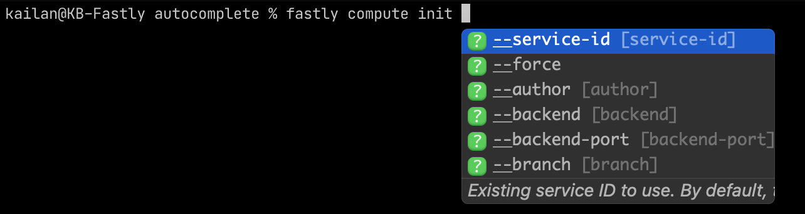

# figly

Generates [Fig Autocompletions](https://github.com/withfig/autocomplete) for the Fastly CLI.

## Instructions

1. Ensure you have the latest Fastly CLI installed.
2. Run `yarn generate`.
3. The output spec will be at `output/fastly.ts`.
